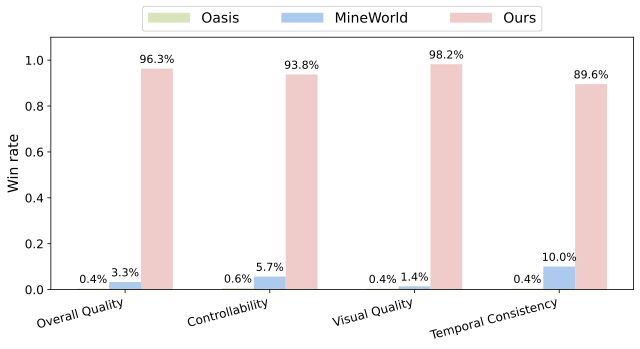

<!-- markdownlint-disable first-line-h1 -->
<!-- markdownlint-disable html -->
<!-- markdownlint-disable no-duplicate-header -->

# Matrix-Game: Interactive World Foundation Model
<font size=7><div align='center' >  [[🤗 Matrix-Game](https://huggingface.co/Skywork/Matrix-Game)] [[📖 Matrix-Game Report](todo)] </div></font>

<div align="center">
  
</div>

## 📝 Overview
**Matrix-Game** is a 17B-parameter Diffusion Transformer for generating high-resolution, physics-consistent videos in interactive game environments. Trained on large-scale data from Minecraft and Unreal Engine, it understands game physics like collisions, destruction, and item placement. Matrix-Game supports real-time, action-conditioned generation, adapting video content dynamically to user input.

You can find more visualizations on our [website](https://brycebywang.github.io/matrixgame.github.io/).

## ✨ Key Features

- 🎯 **Feature 1**: **Core Model.** A diffusion-based image-to-world generator that turns user inputs (keyboard, mouse) into controllable, coherent interactive videos.
- 🚀 **Feature 2**: **GameWorld Score.** A unified evaluation metric covering visual quality, temporal consistency, controllability, and physical plausibility.
- 💡 **Feature 3**: **Matrix-Game Dataset.(Coming soon)** A large-scale Minecraft dataset with annotated action data for learning complex interactions.

## 🔥 Latest Updates

* [2025-05] 🎉 Initial release of Matrix-Game

## 🚀 Performance Comparison
### GameWorld Score Benchmark Comparison

| Model     | Image Quality ↑ | Aesthetic ↑ | Temporal Cons. ↑ | Motion Smooth. ↑ | Keyboard Acc. ↑ | Mouse Acc. ↑ | 3D Cons. ↑ |
|-----------|------------------|-------------|-------------------|-------------------|------------------|---------------|-------------|
| Oasis     | 0.65             | 0.48        | 0.94              | **0.98**          | 0.77             | 0.56          | 0.56        |
| MineWorld | 0.69             | 0.47        | 0.95              | **0.98**          | 0.86             | 0.64          | 0.51        |
| **Ours**  | **0.72**         | **0.49**    | **0.97**          | **0.98**          | **0.95**         | **0.95**      | **0.76**    |

**Metric Descriptions**:

- **Image Quality** / **Aesthetic**: Visual fidelity and perceptual appeal of generated frames  
- **Temporal Consistency** / **Motion Smoothness**: Temporal coherence and smoothness between frames  
- **Keyboard Accuracy** / **Mouse Accuracy**: Accuracy in following user control signals  
- **3D Consistency**: Geometric stability and physical plausibility over time

### Human Evaluation



> Double-blind human evaluation by two independent groups across four key dimensions: **Overall Quality**, **Controllability**, **Visual Quality**, and **Temporal Consistency**.  
> Scores represent the percentage of pairwise comparisons in which each method was preferred. Matrix-Game consistently outperforms prior models across all metrics and both groups.


## 🚀 Quick Start

```
# clone the repository:
git clone https://github.com/SkyworkAI/Matrix-Game.git
cd Matrix-Game

# install dependencies:
pip install -r requirements.txt

# install apex and FlashAttention-3
# Our project also depends on [apex](https://github.com/NVIDIA/apex) and [FlashAttention-3](https://github.com/Dao-AILab/flash-attention)

# inference
bash run_inference.sh
```

## ⭐ Acknowledgements

We would like to express our gratitude to:

- [Diffusers](https://github.com/huggingface/diffusers) for their excellent diffusion model framework
- [HunyuanVideo](https://github.com/Tencent/HunyuanVideo) for their strong base model
- [MineDojo](https://minedojo.org/knowledge_base) for their Minecraft video dataset
- [MineRL](https://github.com/minerllabs/minerl) for their excellent gym framework
- [Video-Pre-Training](https://github.com/openai/Video-Pre-Training) for their accurate Inverse Dynamics Model
- [GameFactory](https://github.com/KwaiVGI/GameFactory) for their great control module idea

We are grateful to the broader research community for their open exploration and contributions to the field of interactive world generation.

## 📄 License

This project is licensed under the MIT License - see the [LICENSE](LICENSE) file for details.

## 📎 Citation
If you find this project useful, please cite our paper:
```bibtex
@article{zhang2025matrixgame,
  title     = {Matrix-Game: Interactive World Foundation Model},
  author    = {Yifan Zhang and Chunli Peng and Boyang Wang and Puyi Wang and Qingcheng Zhu and Zedong Gao and Eric Li and Yang Liu and Yahui Zhou},
  journal   = {arXiv},
  year      = {2025}
}
```
